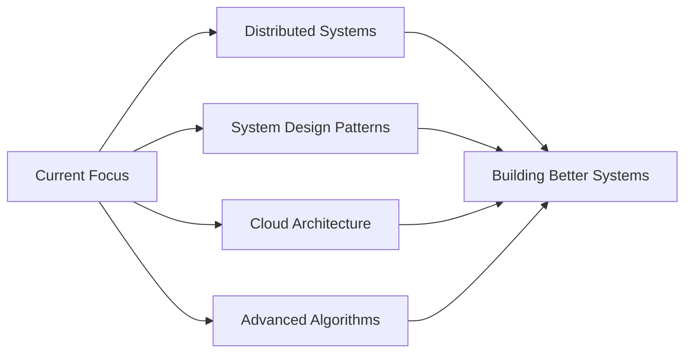

<div align=”center”>
  
</div>

<div align=”center”>
  
  # 👨‍💻 Utkarsh Jain
  
  [](https://git.io/typing-svg)
  
  <p align=”center”>
    <a href=”https://www.linkedin.com/in/utkarshjainlpu/”></a>
    <a href=”mailto:utkarshjain7869@gmail.com”></a>
    <a href=”https://leetcode.com/u/Utkarsh_Jain/”></a>
    <a href=”https://github.com/Utkarsh-Jain-LPU”></a>
  </p>
  
  
  
</div>

<br/>

## 🎯 Professional Summary

```yaml
name: Utkarsh Jain
role: Software Engineer @ Informatica
location: India
experience: 3+ years
focus: [Backend Systems, Graph Databases, Performance Optimization]
currently_exploring: [Distributed Systems, Advanced System Design, Cloud Architecture]
available_for: [Full-time Opportunities, Consulting, Collaboration]
```

> 🚀 **Backend Engineer** specializing in **high-performance Java systems** and **graph database architectures**. Proven track record of delivering **400% performance improvements** and building **scalable enterprise solutions** at Informatica.

<br/>

## 💼 Experience Highlights

<details open>
<summary><b>🏢 Software Engineer @ Informatica</b> <i>(Click to expand)</i></summary>
<br/>

- 🎯 **Performance Optimization:** Achieved **400% faster** Cypher query execution and **30% memory reduction** through advanced optimization techniques
- 🏗️ **Enterprise Scheduler:** Architected and deployed custom job automation system using **Spring Boot & Quartz**, handling thousands of scheduled tasks
- 📊 **Graph Analytics Platform:** Developed internal **Neo4j-based visualization and analytics platform** serving multiple business units
- 🏆 **Recognition:** Received **Outstanding Project Contribution Award (Q2 2023)** for exceptional technical delivery
- 🔧 **System Design:** Led design and implementation of **microservices architecture** for data processing pipelines
- 📈 **Impact:** Reduced system latency by **60%** and improved data processing throughput by **3x**

</details>

<br/>

## 🛠️ Technical Arsenal

<div align=”center”>

### 💻 Languages


### 🎨 Frameworks & Technologies


### 🗄️ Databases


### ⚙️ DevOps & Tools


</div>

<br/>

## 🎖️ Key Achievements

<table>
<tr>
<td width=”50%” valign=”top”>

### ⚡ Performance Engineering
```
📊 400% Query Performance Boost
💾 30% Memory Optimization
🚀 60% Latency Reduction
📈 3x Throughput Improvement
```

</td>
<td width=”50%” valign=”top”>

### 🏗️ System Architecture
```
🔧 Enterprise Job Scheduler
📊 Graph Analytics Platform
🏛️ Microservices Architecture
🔄 Data Processing Pipelines
```

</td>
</tr>
</table>

<br/>

## 📊 GitHub Analytics

<div align=”center”>
  
  
</div>

<div align=”center”>
  
  
</div>

<br/>

## 🎓 Continuous Learning



<div align=”center”>

### 🌱 Currently Exploring
**Distributed Systems** • **Advanced System Design** • **Cloud-Native Architecture** • **Performance Tuning** • **Data Modeling Patterns**

</div>

<br/>

## 🤝 Let's Connect

<div align=”center”>

### 💬 Open to discuss:
🎯 Backend Architecture • 🗄️ Graph Databases • ⚡ Performance Optimization • 🏗️ System Design • 🚀 Career Opportunities

<br/>

**📧 Email:** [utkarshjain7869@gmail.com](mailto:utkarshjain7869@gmail.com)  
**💼 LinkedIn:** [linkedin.com/in/utkarshjainlpu](https://www.linkedin.com/in/utkarshjainlpu/)  
**🏆 LeetCode:** [Utkarsh_Jain](https://leetcode.com/u/Utkarsh_Jain/)

<br/>

---


</div>
