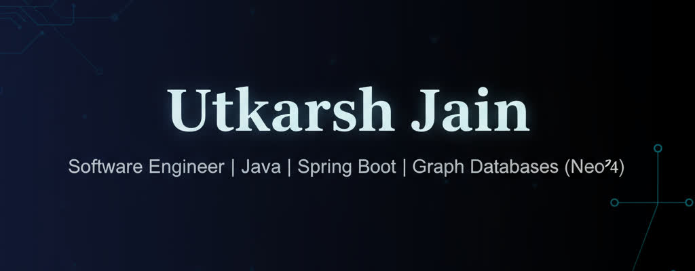

<div align="center">
  
</div>

<h1 align="center">👨‍💻 Utkarsh Jain</h1>

<h3 align="center">Software Engineer @ Salesforce | Backend Systems Specialist | Graph Database Expert</h3>

<p align="center">
  <a href="https://www.linkedin.com/in/utkarshjainlpu/">
    
  </a>
  <a href="mailto:utkarshjain7869@gmail.com">
    
  </a>
  <a href="https://leetcode.com/u/Utkarsh_Jain/">
    
  </a>
  <a href="https://github.com/Utkarsh-Jain-LPU">
    
  </a>
</p>

<p align="center">
  
</p>

---

## 🎯 Professional Summary

**Software Engineer @ Salesforce** with **5.5+ years** of experience building high-performance backend systems and graph database architectures.

```
📍 Location: India
💼 Current Role: Software Engineer @ Salesforce (Since March 2026)
💼 Previous: Software Engineer @ Informatica (Sept 2020 - Feb 2026)
🎓 Specialization: Backend Systems, Graph Databases, Performance Optimization
🚀 Looking for: Full-time Opportunities, Consulting, Collaboration
```

> Backend Engineer specializing in **high-performance Java systems** and **graph database architectures**. Proven track record of delivering **400% performance improvements** and building **scalable enterprise solutions** across leading tech companies.

---

## 💼 Experience Highlights

### 🏢 Software Engineer @ Salesforce
**March 2026 - Present**

- 🚀 Recently joined Salesforce to work on cutting-edge backend systems
- 💼 Contributing to enterprise-scale cloud platform development
- 🔧 Working with distributed systems and scalable architectures

### 🏢 Software Engineer @ Informatica
**September 2020 - February 2026 (5.5 years)**

**Performance Optimization**
- ⚡ Achieved **400% faster** Cypher query execution
- 💾 Reduced memory usage by **30%** through advanced optimization
- 🚀 Decreased system latency by **60%**
- 📈 Improved data processing throughput by **3x**

**Key Projects**
- 🔧 **Enterprise Scheduler**: Architected custom job automation system using Spring Boot & Quartz, handling thousands of scheduled tasks
- 📊 **Graph Analytics Platform**: Developed internal Neo4j-based visualization and analytics platform serving multiple business units
- 🏛️ **Microservices Architecture**: Led design and implementation of data processing pipelines

**Recognition**
- 🏆 Outstanding Project Contribution Award (Q2 2023)

---

## 🛠️ Technical Stack

### Languages


### Frameworks & Technologies


### Databases


### DevOps & Tools


---

## 🎖️ Key Achievements

| ⚡ Performance Engineering | 🏗️ System Architecture |
|---------------------------|------------------------|
| 📊 400% Query Performance Boost | 🔧 Enterprise Job Scheduler |
| 💾 30% Memory Optimization | 📊 Graph Analytics Platform |
| 🚀 60% Latency Reduction | 🏛️ Microservices Architecture |
| 📈 3x Throughput Improvement | 🔄 Data Processing Pipelines |

---

## 📊 GitHub Statistics

<p align="center">
  <a href="https://github.com/Utkarsh-Jain-LPU">
    
  </a>
</p>

<p align="center">
  <a href="https://github.com/Utkarsh-Jain-LPU">
    
  </a>
</p>

<p align="center">
  <a href="https://github.com/Utkarsh-Jain-LPU">
    
  </a>
</p>

---

## 🌱 Continuous Learning

**Current Focus Areas:**
- 🔍 Distributed Systems Architecture
- 📐 Advanced System Design Patterns
- ☁️ Cloud-Native Architecture
- ⚡ Performance Tuning & Optimization
- 📊 Data Modeling Patterns

---

## 🤝 Let's Connect

**Open to discuss:**
- 🎯 Backend Architecture & System Design
- 🗄️ Graph Databases & Neo4j
- ⚡ Performance Optimization Strategies
- 🚀 Career Opportunities & Collaboration

### 📫 Contact Information

- **📧 Email:** utkarshjain7869@gmail.com
- **💼 LinkedIn:** [linkedin.com/in/utkarshjainlpu](https://www.linkedin.com/in/utkarshjainlpu/)
- **🏆 LeetCode:** [leetcode.com/u/Utkarsh_Jain](https://leetcode.com/u/Utkarsh_Jain/)
- **👨‍💻 GitHub:** [github.com/Utkarsh-Jain-LPU](https://github.com/Utkarsh-Jain-LPU)

---

<div align="center">
  
### ⭐ "Building scalable systems, one commit at a time"

**💡 Open to new opportunities and collaborations!**

</div>
